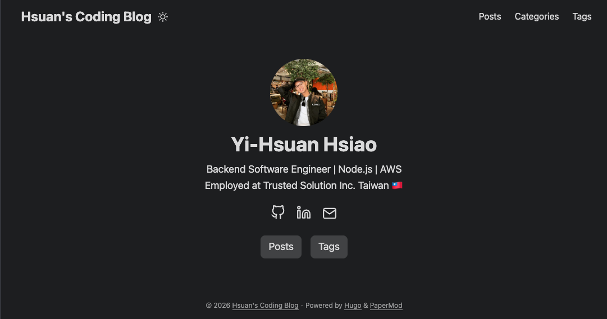
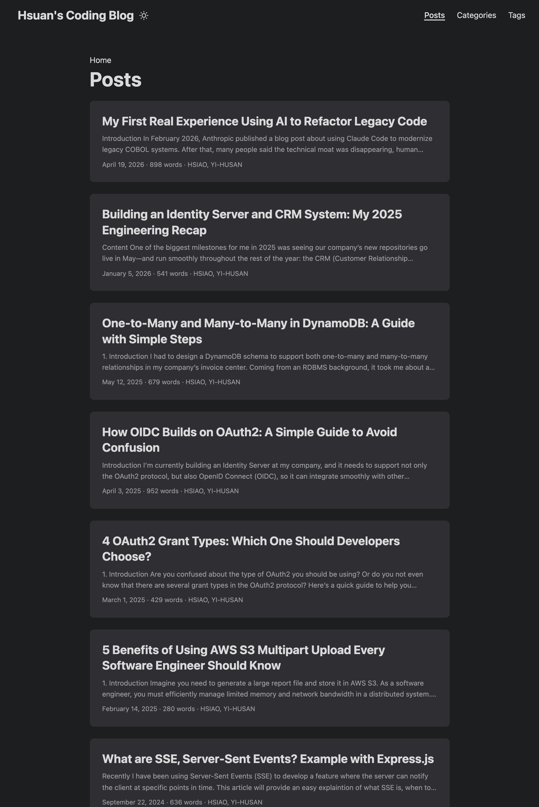

# Hsuan's Coding Blog

Personal coding blog built with Hugo and deployed on Netlify.

- hugo version: v0.111.3+extended
- theme: PaperMod

## Preview

| Cover |
| --- |
|  |

| Posts Section | Single Post |
| --- | --- |
|  |  |

## Local Development

Start local server:

```bash
hugo server
```

Build static site:

```bash
hugo
```
